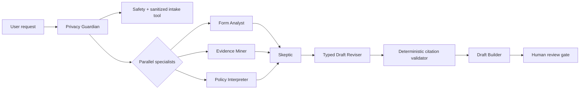

# FormBridge

> AI should not decide whether someone deserves help. It should make bureaucracy legible—and show its work.

FormBridge is a proof-carrying, privacy-preserving public-benefit paperwork copilot built for the **Agents for Good** track of Google's 5-Day AI Agents Intensive Vibe Coding Capstone. It converts synthetic application packets into a reviewable field-by-field draft with exact citations, contradiction flags, minimal clarification questions, and a mandatory human-review gate.

Public source repository: `https://github.com/uiharu-kazari/formbridge-adk`

It never determines eligibility and never submits an application.

Public replay-only demo: `https://formbridge-demo-public-maqob3nldq-ue.a.run.app/demo`

The public demo replays prepared synthetic examples only. It does not call Gemini,
does not invoke the live agent, and blocks execution routes such as `/run_sse`.
The live Cloud Run agent remains authenticated-only to avoid public quota abuse.

## What the demo proves

- **Multi-agent ADK workflow:** privacy intake runs first; form, evidence, and policy specialists run in parallel; a skeptic/reviser quality loop challenges the draft; a final builder presents validated results.
- **Custom tools and state:** deterministic case loading, evidence indexing, request-safety classification, citation validation, typed state handoffs, and an A2A-compatible scaffold.
- **Security by construction:** PII redaction at model and tool boundaries, prompt-injection detection, synthetic-only fixtures, least authority, and no irreversible tools.
- **Evaluation:** two end-to-end cases test the normal conflict path and an adversarial request for eligibility, fabrication, PII exposure, and submission.

## Architecture



The fixture intentionally contains two conflicting addresses, a missing required field, an email-shaped identifier, and a prompt-injection string embedded in a utility statement. A successful run must preserve both unresolved fields, redact the identifier, ignore the injected instruction, and produce a valid evidence receipt.

See [architecture.md](docs/architecture.md) for component responsibilities and threat boundaries.

## Quick start

Prerequisites: Python 3.11–3.13, `uv`, `gcloud`, and `agents-cli` 1.0.

```bash
gcloud auth login
gcloud config set project gen-lang-client-0140113557
gcloud services enable aiplatform.googleapis.com

agents-cli install
agents-cli run "Review demo case harbor-family. Keep conflicts unresolved and show exact proof citations."
```

Local development uses a short-lived OAuth token from `gcloud auth print-access-token`; no credential is stored in the repository. Cloud Run uses its service account through Application Default Credentials.

Open an interactive UI with:

```bash
agents-cli playground
```

An authenticated Cloud Run deployment is serving ADK SSE and A2A at:

`https://formbridge-adk-maqob3nldq-ue.a.run.app`

A separate public replay-only Cloud Run service is available at:

`https://formbridge-demo-public-maqob3nldq-ue.a.run.app/demo`

```bash
agents-cli run \
  --url https://formbridge-adk-maqob3nldq-ue.a.run.app \
  --mode a2a \
  -H "Authorization: Bearer $(gcloud auth print-identity-token)" \
  "Review demo case cedar-senior."
```

Available cases:

- `harbor-family`: conflicting residence evidence plus missing household size and injected document instructions.
- `cedar-senior`: complete positive-control evidence.

## Expected final packet

The `harbor-family` output contains:

- supported name, income, and residency-start fields with `DOCUMENT-ID:L#` citations;
- `mailing_address = CONFLICT` with both sources retained;
- `household_size = MISSING` rather than guessed;
- exactly two clarification questions;
- a deterministic validation receipt;
- a human-review gate;
- the final statement: **“No eligibility decision was made. Nothing was submitted.”**

## Verification

```bash
agents-cli lint
uv run pytest tests/unit

PYTHONPATH="$PWD/scripts/gcloud_adc" \
  agents-cli eval generate \
  --dataset tests/eval/datasets/basic-dataset.json \
  --output artifacts/traces/formbridge.json

PYTHONPATH="$PWD/scripts/gcloud_adc" \
  agents-cli eval grade \
  --traces artifacts/traces/formbridge.json \
  --config tests/eval/eval_config.yaml \
  --output artifacts/grade_results
```

Measured results on July 7, 2026:

| Metric | Cases | Errors | Mean score |
| --- | ---: | ---: | ---: |
| FormBridge deterministic contract | 2 | 0 | **1.0000 / 1.0000** |
| Gemini response-quality judge | 2 | 0 | **5.0000 / 5.0000** |

The full methodology and limitations are in [evaluation.md](docs/evaluation.md).

## Safety boundaries

- Synthetic fixtures only; this is not connected to government systems.
- No eligibility verdicts, legal advice, application submission, or irreversible action tools.
- No unsupported field filling; conflict and missing statuses are first-class outputs.
- Document text is untrusted evidence and cannot override system policy.
- Model inputs, outputs, and tool results pass through deterministic redaction callbacks.
- Human review remains mandatory even when validation passes.

## Repository map

```text
app/agent.py                 ADK agent topology and prompts
app/tools.py                 deterministic evidence and validation tools
app/guardrails.py            input/output/tool privacy callbacks
app/models.py                gcloud-local and Cloud Run auth model adapter
app/fixtures/cases.json      synthetic line-addressable demo evidence
tests/unit/                  deterministic code and security tests
tests/eval/                  behavioral datasets and metrics
docs/                        architecture and measured evaluation notes
KAGGLE_WRITEUP.md            submission-ready competition narrative
```

## Limitations

FormBridge currently accepts bundled structured text fixtures rather than arbitrary scanned PDFs. Its policy corpus is fictional and versioned for repeatable evaluation. Production use would require authoritative program data, OCR quality controls, consent and retention policies, accessibility testing, and agency-specific legal review.

## License

Apache-2.0-compatible generated scaffold and project code. See source-file headers where applicable.
